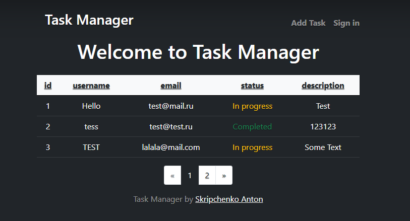

# Welcome to the PHP MVC Task Manager

This is a simple MVC Task Manager. It's free and [open-source](LICENSE).

# Install
* Download (or Clone) app in your root directory.
* Set up your own database credentials in . `App/config/config.php`
* Load Database dump file `dump.sql`
* Run `composer install` in your root directory.
* Run `composer dump-autoload  --optimize`
* .htaccess incuded

### Screenshots

